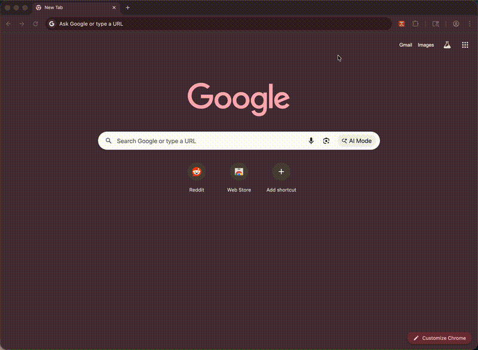

# Reddit Delay

Reddit Delay breaks the habit of opening Reddit on autopilot. It turns a mindless reflex into a conscious choice by adding a countdown timer between you and Reddit. Wait out the timer to unlock Reddit.

**Privacy first**: Instead of asking you to take our word for it, we let Chrome enforce your privacy by requesting the minimal permissions possible. Reddit Delay can only access Reddit — not every website you visit.

**Configurable**: Set your own wait time and unlock duration via the options page.

## How it works

1. Navigate to any `reddit.com` URL
2. A full-page overlay appears with a countdown timer (default: 30 seconds)
3. Once the countdown completes, Reddit is unlocked for a set duration (default: 15 minutes)

## Dev Installation

1. Clone or download this repository
2. Open Chrome and go to `chrome://extensions`
3. Enable **Developer mode** (top right toggle)
4. Click **Load unpacked** and select the project folder
5. Visit any `reddit.com` URL to see it in action

## Development

After any code change:

1. Go to `chrome://extensions`
2. Click the reload (↺) button on the extension card
3. Reload any open Reddit tabs
